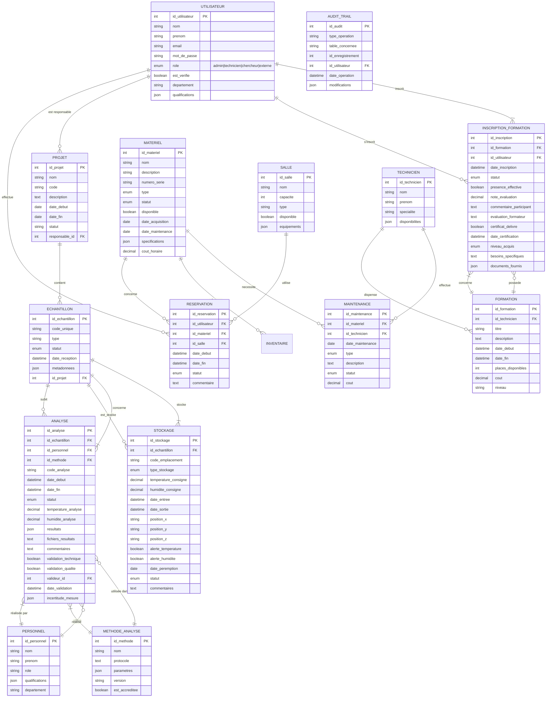

# My ERD Diagram MUSIICS

```mermaid
erDiagram
    %% Gestion des Utilisateurs
    UTILISATEUR ||--o{ RESERVATION : effectue
    UTILISATEUR ||--o{ PROJET : "est responsable"
    UTILISATEUR ||--o{ INSCRIPTION_FORMATION : "s'inscrit"
    UTILISATEUR {
        int id_utilisateur PK
        string nom
        string prenom
        string email
        string mot_de_passe
        enum role "admin|technicien|chercheur|externe"
        boolean est_verifie
        string departement
        json qualifications
    }

    %% Gestion des Analyses
    ANALYSE }|--|| ECHANTILLON : "concerne"
    ANALYSE }|--|| PERSONNEL : "réalisée par"
    ANALYSE }|--|| METHODE_ANALYSE : "utilise"
    ANALYSE {
        int id_analyse PK
        int id_echantillon FK
        int id_personnel FK
        int id_methode FK
        string code_analyse
        datetime date_debut
        datetime date_fin
        enum statut
        decimal temperature_analyse
        decimal humidite_analyse
        json resultats
        text fichiers_resultats
        text commentaires
        boolean validation_technique
        boolean validation_qualite
        int valideur_id FK
        datetime date_validation
        json incertitude_mesure
    }

    %% Gestion du Stockage
    STOCKAGE }|--|| ECHANTILLON : "stocke"
    STOCKAGE {
        int id_stockage PK
        int id_echantillon FK
        string code_emplacement
        enum type_stockage
        decimal temperature_consigne
        decimal humidite_consigne
        datetime date_entree
        datetime date_sortie
        string position_x
        string position_y
        string position_z
        boolean alerte_temperature
        boolean alerte_humidite
        date date_peremption
        enum statut
        text commentaires
    }

    %% Gestion des Inscriptions Formation
    INSCRIPTION_FORMATION }|--|| FORMATION : "concerne"
    INSCRIPTION_FORMATION }|--|| UTILISATEUR : "inscrit"
    INSCRIPTION_FORMATION {
        int id_inscription PK
        int id_formation FK
        int id_utilisateur FK
        datetime date_inscription
        enum statut
        boolean presence_effective
        decimal note_evaluation
        text commentaire_participant
        text evaluation_formateur
        boolean certificat_delivre
        datetime date_certification
        enum niveau_acquis
        text besoins_specifiques
        json documents_fournis
    }

    %% Tables existantes...
    MATERIEL ||--o{ RESERVATION : concerne
    MATERIEL ||--o{ INVENTAIRE : reference
    MATERIEL ||--o{ MAINTENANCE : necessite
    MATERIEL {
        int id_materiel PK
        string nom
        string description
        string numero_serie
        enum type
        enum statut
        boolean disponible
        date date_acquisition
        date date_maintenance
        json specifications
        decimal cout_horaire
    }

    SALLE ||--o{ RESERVATION : utilise
    SALLE {
        int id_salle PK
        string nom
        int capacite
        string type
        boolean disponible
        json equipements
    }

    RESERVATION {
        int id_reservation PK
        int id_utilisateur FK
        int id_materiel FK
        int id_salle FK
        datetime date_debut
        datetime date_fin
        enum statut
        text commentaire
    }

    FORMATION ||--o{ INSCRIPTION_FORMATION : possede
    FORMATION {
        int id_formation PK
        int id_technicien FK
        string titre
        text description
        datetime date_debut
        datetime date_fin
        int places_disponibles
        decimal cout
        string niveau
    }

    TECHNICIEN ||--o{ FORMATION : dispense
    TECHNICIEN ||--o{ MAINTENANCE : effectue
    TECHNICIEN {
        int id_technicien PK
        string nom
        string prenom
        string specialite
        json disponibilites
    }

    PROJET ||--o{ ECHANTILLON : contient
    PROJET {
        int id_projet PK
        string nom
        string code
        text description
        date date_debut
        date date_fin
        string statut
        int responsable_id FK
    }

    ECHANTILLON ||--o{ ANALYSE : subit
    ECHANTILLON ||--o{ STOCKAGE : est_stocke
    ECHANTILLON {
        int id_echantillon PK
        string code_unique
        string type
        enum statut
        datetime date_reception
        json metadonnees
        int id_projet FK
    }

    METHODE_ANALYSE ||--o{ ANALYSE : "utilisée dans"
    METHODE_ANALYSE {
        int id_methode PK
        string nom
        text protocole
        json parametres
        string version
        boolean est_accreditee
    }

    PERSONNEL ||--o{ ANALYSE : realise
    PERSONNEL {
        int id_personnel PK
        string nom
        string prenom
        string role
        json qualifications
        string departement
    }

    MAINTENANCE {
        int id_maintenance PK
        int id_materiel FK
        int id_technicien FK
        date date_maintenance
        enum type
        text description
        enum statut
        decimal cout
    }

    AUDIT_TRAIL {
        int id_audit PK
        string type_operation
        string table_concernee
        int id_enregistrement
        int id_utilisateur FK
        datetime date_operation
        json modifications
    }
```
